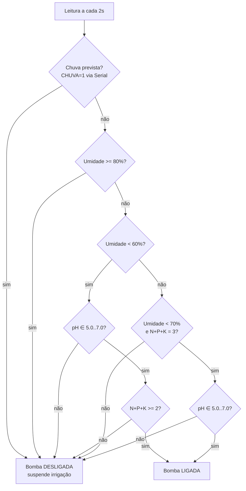

# Diagrama da lógica de irrigação — Café

## Tabela verdade resumida (cultura: café)

| Umidade | pH | N+P+K | Chuva | Bomba |
|---------|----|-------|-------|-------|
| < 60% | 5.0–7.0 | ≥ 2 | não | **LIGA** |
| < 60% | fora faixa | qualquer | não | desliga |
| 60–70% | 5.0–7.0 | = 3 | não | **LIGA** (preventiva) |
| 60–80% | qualquer | < 3 | não | desliga |
| ≥ 80% | qualquer | qualquer | qualquer | desliga (encharcado) |
| qualquer | qualquer | qualquer | sim | desliga (chuva) |

## Justificativa agronômica — Café (Coffea arabica)

Referências: Embrapa Café, boletins MAPA, manuais de cafeicultura.

- **pH ideal do solo**: 5.5 a 6.5 (ácido a levemente ácido). Fora dessa faixa,
  a absorção de nutrientes cai drasticamente mesmo que eles estejam presentes.
  Na simulação o enunciado permite ampliar a escala para melhorar a usabilidade
  do slider do LDR, por isso aceitamos **5.0–7.0** no Wokwi (ideal 5.5–6.5,
  com tolerância de ±0.5).
- **Umidade do solo**:
  - Abaixo de 60%: déficit hídrico, principalmente crítico nas fases de
    florada e enchimento de grãos.
  - Acima de 80%: risco de encharcamento, favorece doenças radiculares
    (ex.: *Phytophthora*).
  - Faixa preventiva 60–70% só justifica irrigação se todos os nutrientes
    estiverem presentes (planejamento de maior produtividade).
- **NPK**: o café precisa de **N** (vegetativo), **P** (sistema radicular) e
  **K** (frutificação). Exigimos pelo menos 2 dos 3 presentes para não
  desperdiçar água em período sem resposta nutricional.
- **Chuva prevista**: irrigar com chuva a caminho é desperdício de água e
  energia — o opcional OpenWeather suspende a bomba nesses casos.
